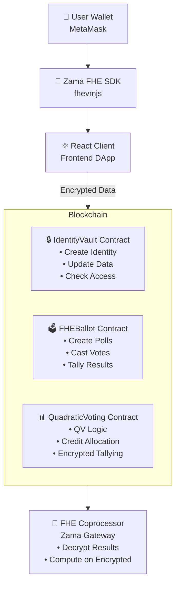
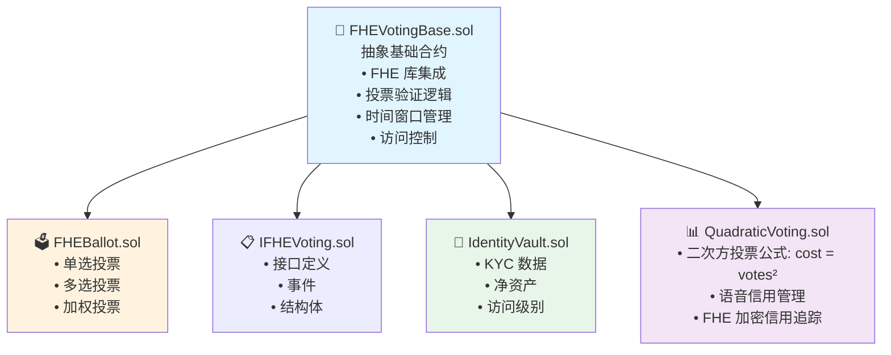
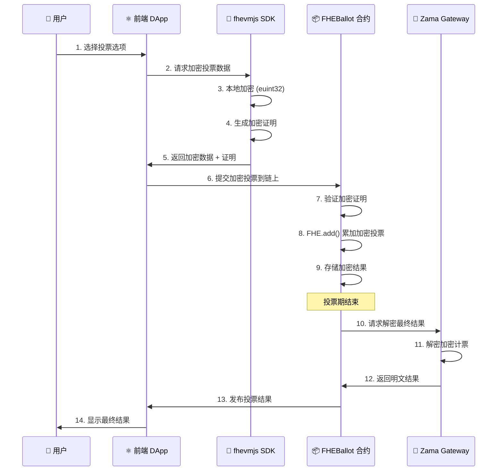

  

  # VeilCivic

  **Privacy-First Identity & Governance Platform**

  
  
  

  [Live Demo](#) | [Documentation](#) | [Architecture](#architecture)

---

## 🌟 Overview

VeilCivic is a next-generation decentralized platform that combines **encrypted identity management** with **privacy-preserving governance**. Built on Zama's Fully Homomorphic Encryption (FHE) technology, VeilCivic enables communities, DAOs, and organizations to manage sensitive identity data and conduct secure voting without ever exposing confidential information on-chain.

### The Problem We Solve

Traditional blockchain systems face a fundamental dilemma:
- **Transparency vs. Privacy**: Public ledgers expose all transaction data, making privacy-sensitive applications impractical
- **Identity Management**: KYC/identity data cannot be stored on-chain without compromising user privacy
- **Voting Security**: Traditional encrypted voting requires trust in third parties or reveals voter choices
- **Compliance Gap**: Regulations require privacy protections that standard blockchains cannot provide

### Our Solution

VeilCivic leverages **Fully Homomorphic Encryption (FHE)** to enable:
- ✅ **Computation on encrypted data** - Process sensitive information without decryption
- ✅ **On-chain privacy** - Store encrypted identity and votes directly on Ethereum
- ✅ **Trustless verification** - No trusted third parties required
- ✅ **Regulatory compliance** - Meet GDPR and data protection requirements

---

## 🎯 Key Features

### 🔐 Encrypted Identity Vault
- **Client-Side Encryption**: User identity data (name, age, nationality, net worth) encrypted before submission
- **Access Level Management**: Tiered access based on encrypted net worth thresholds
- **Zero-Knowledge Proofs**: Verify identity attributes without revealing actual values
- **Self-Sovereign Identity**: Users maintain full control over their encrypted data

### 🗳️ Privacy-Preserving Voting System
- **Multiple Voting Types**:
  - Single Choice: Traditional one-person-one-vote
  - Multi-Choice: Select multiple options
  - Weighted Voting: Token-based voting power
  - Quadratic Voting: Democratic credit allocation
- **Encrypted Vote Tallying**: Votes remain encrypted throughout the entire process
- **Time-Gated Voting**: Automatic enforcement of voting periods
- **Whitelist Support**: Restrict voting to approved participants
- **Encrypted Results**: Final tallies computed on encrypted votes via FHE Gateway

### 🎛️ Advanced Governance
- **Configurable Quorum**: Set minimum participation requirements
- **Flexible Time Windows**: Define start/end times for voting periods
- **Multi-Option Polls**: Support for complex voting scenarios
- **Result Decryption**: Authorized decryption of final results after voting ends

---

## 🔬 Why Fully Homomorphic Encryption?

### Traditional Encryption vs. FHE

| Feature | Traditional Encryption | Fully Homomorphic Encryption |
|---------|----------------------|------------------------------|
| **Data Storage** | Encrypted ✅ | Encrypted ✅ |
| **Computation** | Requires decryption ❌ | Compute on encrypted data ✅ |
| **Smart Contracts** | Cannot process encrypted data ❌ | Native encrypted operations ✅ |
| **Privacy** | Data exposed during computation ❌ | End-to-end privacy ✅ |
| **Trust Model** | Requires trusted decryptor ❌ | Fully trustless ✅ |

### FHE in Action: Voting Example

\`\`\`solidity
// Traditional approach (privacy leak)
function vote(uint256 choice) public {
    votes[choice]++; // ❌ Vote is public!
}

// FHE approach (private voting)
function castVote(uint256 votingId, inEuint32 calldata encryptedChoice) public {
    euint32 choice = FHE.asEuint32(encryptedChoice);
    // ✅ Vote remains encrypted, but can still be counted!
    encryptedTally[votingId] = FHE.add(encryptedTally[votingId], choice);
}
\`\`\`

### Real-World Benefits

1. **Regulatory Compliance**: Meet GDPR "right to be forgotten" while keeping data on-chain
2. **Auction & Bidding**: Sealed-bid auctions with encrypted bids
3. **Healthcare**: Share encrypted medical records for research without exposing patient data
4. **Finance**: Private DeFi transactions while maintaining auditability
5. **Voting**: Secret ballot elections without trusted third parties

---

## 🏗️ Architecture

### System Overview

**架构说明：**
- **前端层**：React + TypeScript 应用，使用 Zama FHE SDK 进行客户端加密
- **区块链层**：三个核心智能合约部署在 Sepolia 测试网
  - `IdentityVault`：加密身份管理
  - `FHEBallot`：隐私投票系统
  - `QuadraticVoting`：二次方投票实现
- **FHE 网关**：Zama Gateway 负责最终结果解密和加密计算

### Contract Architecture

**合约继承关系：**
- `FHEVotingBase.sol`：所有投票合约的抽象基类，封装 FHE 通用逻辑
- `FHEBallot.sol`：继承基类，实现传统投票类型
- `QuadraticVoting.sol`：继承基类，实现二次方投票
- `IdentityVault.sol`：独立合约，管理加密身份数据
- `IFHEVoting.sol`：接口合约，定义标准

### Data Flow: 加密投票流程

**关键步骤说明：**
1. **客户端加密**：所有敏感数据在浏览器端加密后才提交
2. **零知识证明**：生成证明以验证加密数据的正确性
3. **链上计算**：使用 FHE 直接在加密数据上进行加法运算
4. **网关解密**：仅在投票结束后通过 Zama Gateway 解密最终结果

---

## 🛠️ Technology Stack

### Frontend
- **React 18** - Modern UI library with hooks
- **TypeScript** - Type-safe development
- **Vite** - Lightning-fast build tool
- **Tailwind CSS** - Utility-first styling
- **shadcn/ui** - Beautiful, accessible components
- **Lucide Icons** - Modern icon library

### Web3 Integration
- **wagmi v2** - React hooks for Ethereum
- **viem** - TypeScript Ethereum library
- **RainbowKit** - Wallet connection UI
- **Privy SDK** - Alternative auth provider

### Blockchain & Encryption
- **Solidity 0.8.19** - Smart contract language
- **Zama fhEVM** - FHE-enabled EVM
- **fhevmjs** - Client-side FHE operations
- **Hardhat** - Development environment
- **Sepolia Testnet** - Ethereum test network

### Key Dependencies
\`\`\`json
{
  "fhevmjs": "^0.8.0",
  "@fhevm/solidity": "^0.1.0",
  "wagmi": "^2.x",
  "viem": "^2.x",
  "@rainbow-me/rainbowkit": "^2.x"
}
\`\`\`

---

## 🚀 Getting Started

### Prerequisites

- **Node.js** 18+ and npm/yarn
- **MetaMask** or compatible Web3 wallet
- **Sepolia ETH** (get from [faucet](https://sepoliafaucet.com/))
- **Git** for cloning repository

### Installation

项目使用 **npm workspaces** 统一管理前端和合约依赖：

\`\`\`bash
# Clone the repository
git clone https://github.com/c3t2n95y5k/FHE-Identity-Vault.git
cd FHE-Identity-Vault

# 方式 1：使用根目录 package.json 统一安装（推荐）
npm install

# 方式 2：分别安装各子项目依赖
cd frontend && npm install && cd ..
cd contracts && npm install && cd ..
\`\`\`

### Configuration

Create \`frontend/.env\`:

\`\`\`env
# Contract Addresses
VITE_IDENTITY_VAULT_ADDRESS=0x6F9d93A540Ad88eEF3EACB1FaF11aEcE2700F3C2
VITE_BALLOT_ADDRESS=0xdb87F76ceA345f6fC0eCA788470Ccd5633071b3D
VITE_QUADRATIC_VOTING_ADDRESS=0x7c71bed2b28bB691fd1c94985436cEFc3997b609

# Network Configuration
VITE_CHAIN_ID=11155111
VITE_RPC_URL=https://ethereum-sepolia-rpc.publicnode.com
VITE_GATEWAY_URL=https://gateway.sepolia.zama.ai

# Wallet Connect
VITE_WALLETCONNECT_PROJECT_ID=your_project_id_here
\`\`\`

Create \`contracts/.env\`:

\`\`\`env
PRIVATE_KEY=your_private_key_here
SEPOLIA_RPC_URL=https://ethereum-sepolia-rpc.publicnode.com
\`\`\`

### Development

使用根目录统一命令（推荐）：

\`\`\`bash
# 启动前端开发服务器
npm run dev
# 访问 http://localhost:8080

# 编译智能合约
npm run compile:contracts

# 部署合约到 Sepolia
npm run deploy:contracts

# 运行合约测试
npm run test
\`\`\`

或者进入子目录单独运行：

\`\`\`bash
# 前端开发
cd frontend
npm run dev

# 合约开发
cd contracts
npx hardhat compile
npx hardhat run scripts/deploy-all.js --network sepolia
npx hardhat run scripts/create-10-votings.js --network sepolia
\`\`\`

### Build for Production

\`\`\`bash
# 从根目录构建
npm run build

# 或进入frontend目录构建
cd frontend
npm run build
npm run preview  # 预览生产构建
\`\`\`

---

## 📊 Project Structure

\`\`\`
FHE-Identity-Vault/
├── frontend/
│   ├── src/
│   │   ├── components/        # React components
│   │   │   ├── BrandLogo.tsx
│   │   │   ├── IdentityCard.tsx
│   │   │   ├── Navigation.tsx
│   │   │   └── VotingCard.tsx
│   │   ├── hooks/             # Custom React hooks
│   │   │   ├── useIdentity.ts
│   │   │   └── useVoting.ts
│   │   ├── lib/               # Utility libraries
│   │   │   ├── contracts.ts   # Contract ABIs & addresses
│   │   │   ├── fhe.ts         # FHE encryption helpers
│   │   │   ├── wagmi.ts       # Wagmi configuration
│   │   │   └── countries.ts   # Country data
│   │   ├── pages/             # Page components
│   │   │   ├── Index.tsx      # Landing page
│   │   │   ├── IdentityNew.tsx
│   │   │   ├── Voting.tsx
│   │   │   └���─ VotingDetail.tsx
│   │   └── types/             # TypeScript types
│   ├── public/                # Static assets
│   └── package.json
│
├── contracts/
│   ├── src/
│   │   ├── FHEBallot.sol          # Main voting contract
│   │   ├── FHEVotingBase.sol      # Base contract with FHE logic
│   │   ├── IFHEVoting.sol         # Interface definitions
│   │   ├── IdentityVault.sol      # Identity management
│   │   └── QuadraticVoting.sol    # Quadratic voting implementation
│   ├── scripts/
│   │   ├── deploy-all.js          # Deploy all contracts
│   │   ├── create-10-votings.js   # Create test data
│   │   └── check-counter.js       # Verify deployment
│   ├── test/                      # Contract tests
│   └── hardhat.config.ts
│
└── README.md
\`\`\`

---

## 🗺️ Roadmap

### 第一阶段：基础建设 (已完成 ✅)
- [x] 智能合约架构设计
- [x] Zama fhEVM FHE 技术集成
- [x] 身份保险库合约实现
- [x] 基础投票机制（单选、多选、加权投票）
- [x] React 前端应用搭建
- [x] 钱包集成（MetaMask、WalletConnect）

### 第二阶段：核心功能 (已完成 ✅)
- [x] 加密身份创建与管理
- [x] 客户端 FHE 加密（fhevmjs）
- [x] 多种投票类型实现
- [x] 时间门控投票周期
- [x] 白名单管理系统
- [x] 二次方投票公式
- [x] 通过 Gateway 解密结果
- [x] Tailwind CSS 响应式 UI

### 第三阶段：增强治理 (进行中 🔄)
- [x] 从合约读取真实投票数据
- [x] FHE 加密投票
- [x] 投票详情页面与实时结果
- [ ] 治理管理仪表板
- [ ] 投票数据分析与统计
- [ ] 投票委托系统
- [ ] 提案创建 UI
- [ ] 多签名投票结果验证

### 第四阶段：高级功能 🔮
- [ ] **身份验证**：集成真实 KYC 服务商
- [ ] **跨链支持**：桥接至 Polygon、Arbitrum
- [ ] **DAO 模板**：预构建的治理结构
- [ ] **移动应用**：React Native 移动端
- [ ] **无 Gas 交易**：元交易改善用户体验
- [ ] **IPFS 集成**：去中心化提案存储
- [ ] **ENS 支持**：人类可读地址

### 第五阶段：企业级与规模化 🔮
- [ ] **API 平台**：第三方集成 REST API
- [ ] **白标解决方案**：可定制企业版
- [ ] **审计与安全**：专业智能合约审计
- [ ] **主网部署**：以太坊主网生产发布
- [ ] **治理代币**：平台原生治理代币
- [ ] **质押机制**：质押代币获得投票权
- [ ] **金库管理**：DAO 多签金库

### 第六阶段：生态系统增长 🔮
- [ ] **SDK 发布**：开发者集成工具包
- [ ] **插件系统**：可扩展投票机制
- [ ] **市场平台**：治理模板和模块
- [ ] **分析平台**：高级投票洞察
- [ ] **教育中心**：教程和文档
- [ ] **资助计划**：资助社区项目
- [ ] **生态合作**：与主流 DAO 集成

---

## 🎮 Usage Examples

### Creating an Identity

\`\`\`typescript
import { useCreateIdentity } from '@/hooks/useIdentity';

const { createIdentity, isCreating } = useCreateIdentity();

// Encrypt and submit identity
await createIdentity({
  name: 'Alice',
  age: 30,
  nationality: 'US',
  netWorth: 50000, // Encrypted client-side
});
\`\`\`

### Creating a Voting Poll

\`\`\`typescript
import { useCreateVoting } from '@/hooks/useVoting';

const { createVoting } = useCreateVoting();

await createVoting({
  name: 'Protocol Upgrade Proposal',
  description: 'Vote on implementing new features',
  voteType: VoteType.Weighted,
  startTime: Math.floor(Date.now() / 1000) + 3600, // Start in 1 hour
  endTime: Math.floor(Date.now() / 1000) + 86400 * 7, // End in 7 days
  quorum: 100,
  whitelistEnabled: false,
  maxVotersCount: 10000,
  optionNames: ['Approve', 'Reject', 'Abstain'],
  optionDescriptions: ['Vote yes', 'Vote no', 'No opinion'],
});
\`\`\`

### Casting an Encrypted Vote

\`\`\`typescript
import { useCastVote } from '@/hooks/useVoting';

const { castVote, isVoting } = useCastVote();

// Vote is encrypted automatically
await castVote(
  votingId: 0,
  optionIndex: 1, // This value is encrypted before submission
);
\`\`\`

---

## 🔒 Security Considerations

### Encryption Flow
1. **Client-Side Encryption**: All sensitive data encrypted before leaving the browser
2. **Proof Generation**: Cryptographic proofs validate encrypted inputs
3. **On-Chain Verification**: Smart contracts verify proofs without decryption
4. **Gateway Decryption**: Only final results decrypted by Zama Gateway

### Best Practices
- Never expose private keys in code or \`.env\` files committed to Git
- Use hardware wallets for production deployments
- Audit smart contracts before mainnet deployment
- Implement rate limiting for voting to prevent spam
- Use time-locks for administrative functions

### Known Limitations
- FHE computations are more expensive than plaintext (higher gas costs)
- Decryption requires Zama Gateway (centralized dependency)
- Currently limited to Sepolia testnet
- Maximum encrypted integer size: \`euint32\` (0 to 2^32-1)

---

## 🤝 Contributing

We welcome contributions! Please follow these guidelines:

1. Fork the repository
2. Create a feature branch (\`git checkout -b feature/amazing-feature\`)
3. Commit your changes (\`git commit -m 'Add amazing feature'\`)
4. Push to the branch (\`git push origin feature/amazing-feature\`)
5. Open a Pull Request

### Development Guidelines
- Follow existing code style (ESLint + Prettier)
- Write tests for new features
- Update documentation for API changes
- Ensure all tests pass before submitting PR

---

## 📄 License

This project is licensed under the MIT License - see the [LICENSE](LICENSE) file for details.

---

## 🙏 Acknowledgments

- **Zama** - For pioneering FHE technology and fhEVM
- **Ethereum Foundation** - For Sepolia testnet infrastructure
- **shadcn/ui** - For beautiful React components
- **Wagmi** - For excellent Web3 React hooks

---

## 📞 Contact & Support

- **GitHub Issues**: [Report bugs or request features](https://github.com/c3t2n95y5k/FHE-Identity-Vault/issues)
- **Documentation**: [Read the docs](#)
- **Twitter**: [@VeilCivic](#)
- **Discord**: [Join our community](#)

---

  **Built with ❤️ using Zama FHE**

  [⬆ Back to Top](#veilcivic)

